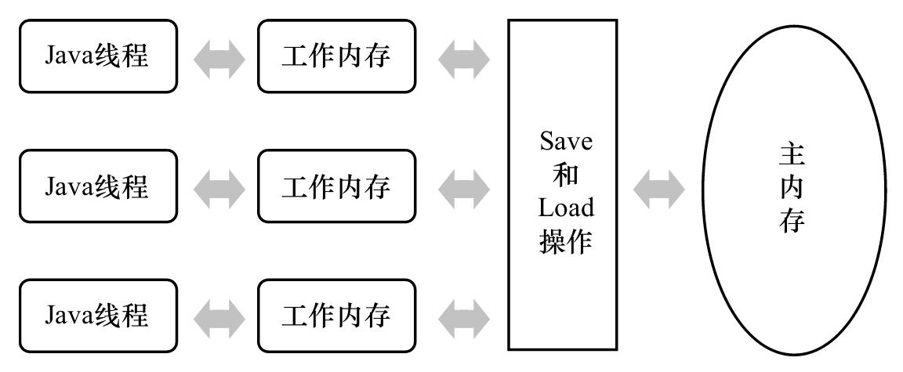

# Java内存模型

 

## 前言

本文主要是周志明《深入理解Java虚拟机：JVM高级特性与最佳实践》的读后感，也有一些其它从网上搜集的资料。主要内容就是尽量说明白什么是Java的内存模型，只有理解了Java的内存模型，后续的多线程才能理解的更为深入。

## 主内存和工作内存

Java内存模型包括主内存和工作内存两个部分：主内存用来存储线程之间的共享变量；而工作内存中存储每个线程的相关变量。
如下图所示：

*需要注意的是：这里所讲的主内存、工作内存与[上篇文章](http://www.cnblogs.com/wardensky/p/4162121.html)里所讲的Java内存区域中的Java堆、栈、方法区等并不是同一个层次的内存划分，这两者基本上是没有关系的。*

#### 内存间交互操作

在上图中可以看到，工作内存和主内存直接，要通过Save和Load等操作进行数据同步，具体来讲，操作包括：

> 1. lock（锁定）：作用于主内存的变量，它把一个变量标识为一条线程独占的状态。   
> 1. unlock（解锁）：作用于主内存的变量，它把一个处于锁定状态的变量释放出来，释放后的变量才可以被其他线程锁定。
> 1. read（读取）：作用于主内存的变量，它把一个变量的值从主内存传输到线程的工作内存中，以便随后的load动作使用。
> 1. load（载入）：作用于工作内存的变量，它把read操作从主内存中得到的变量值放入工作内存的变量副本中。   
> 1. use（使用）：作用于工作内存的变量，它把工作内存中一个变量的值传递给执行引擎，每当虚拟机遇到一个需要使用到变量的值的字节码指令时将会执行这个操作。   
> 1. assign（赋值）：作用于工作内存的变量，它把一个从执行引擎接收到的值赋给工作内存的变量，每当虚拟机遇到一个给变量赋值的字节码指令时执行这个操作。
> 1. store（存储）：作用于工作内存的变量，它把工作内存中一个变量的值传送到主内存中，以便随后的write操作使用。
> 1. write（写入）：作用于主内存的变量，它把store操作从工作内存中得到的变量的值放入主内存的变量中。

read+load完成把变量从主内存读取到工作内存，store+write完成把变量从工作内存写入到住内存。为了保证数据的同步性，上述操作直接定义了一些规则，在此不描述这些规则。
这8种内存访问操作以及上述规则限定，再加上之前文章中介绍的对volatile的一些特殊规定，就已经完全确定了Java程序中哪些内存访问操作在并发下是安全的。

总结：本文描述了Java的内存模型，即主内存和工作内存以及二者之间的操作，了解了这些内容，对Java的线程同步等内容会有更清晰的了解。

## 参考

[深入理解Java内存模型（一）——基础](http://www.infoq.com/cn/articles/java-memory-model-1)

[深入理解JVM—JVM内存模型]()

《深入理解JVM虚拟机》
