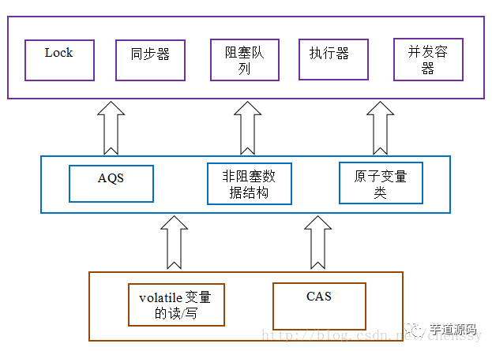

# CAS简介


## 简介

CAS全称compare-and-swap，是计算机科学中一种实现多线程原子操作的指令，它比较内存中当前存在的值和外部给定的期望值，只有两者相等时，才将这个内存值修改为新的给定值。CAS操作包含三个操作数，需要读写的内存位置（V）、拟比较的预期原值（A）和拟写入的新值（B），如果V的值和A的值匹配，则将V的值更新为B，否则不做任何操作。多线程尝试使用CAS更新同一变量时，只有一个线程可以操作成功，其他的线程都会失败，失败的线程不会被挂起，只是在此次竞争中被告知失败，下次可以继续尝试CAS操作的。

目前的处理器基本都支持CAS，只不过不同的厂家的实现不一样罢了。CAS有三个操作数：内存值V、旧的预期值A、要修改的值B，当且仅当预期值A和内存值V相同时，将内存值修改为B并返回true，否则什么都不做并返回false。

```
public int a = 1;
public boolean compareAndSwapInt(int b) {
    if (a == 1) {
        a = b;
        return true;
    }
    return false;
}
```

试想这段代码在多线程并发下，会发生什么？我们不妨来分析一下：

线程A执行到 a==1，正准备执行a = b时，线程B也正在运行a = b，并在线程A之前把a修改为2；最后线程A又把a修改成了3。结果就是两个线程同时修改了变量a，显然这种结果是无法符合预期的，无法确定a的值。

解决方法也很简单，在compareAndSwapInt方法加锁同步，变成一个原子操作，同一时刻只有一个线程才能修改变量a。

CAS中的比较和替换是一组原子操作，不会被外部打断，先根据paramLong/paramLong1获取到内存当中当前的内存值V，在将内存值V和原值A作比较，要是相等就修改为要修改的值B，属于硬件级别的操作，效率比加锁操作高。




## AtomicInteger里面的CAS

java.util.concurrent.atomic包下的原子操作类都是基于CAS实现的，接下去我们通过AtomicInteger来看看是如何通过CAS实现原子操作的：


```
public class AtomicInteger extends Number implements java.io.Serializable {
    // setup to use Unsafe.compareAndSwapInt for updates
    private static final Unsafe unsafe = Unsafe.getUnsafe();
    private static final long valueOffset;

    static {
        try {
            valueOffset = unsafe.objectFieldOffset
                (AtomicInteger.class.getDeclaredField("value"));
        } catch (Exception ex) { throw new Error(ex); }
    }

    private volatile int value;
    public final int get() {return value;}
}
```

Unsafe是CAS的核心类，Java无法直接访问底层操作系统，而是通过本地（native）方法来访问。不过尽管如此，JVM还是开了一个后门，JDK中有一个类Unsafe，它提供了硬件级别的原子操作。
valueOffset表示的是变量值在内存中的偏移地址，因为Unsafe就是根据内存偏移地址获取数据的原值的。
value是用volatile修饰的，保证了多线程之间看到的value值是同一份。

接下去，我们看看AtomicInteger是如何实现并发下的累加操作：

```
//jdk1.8实现
public final int getAndAdd(int delta) {    
    return unsafe.getAndAddInt(this, valueOffset, delta);
}

public final int getAndAddInt(Object var1, long var2, int var4) {
    int var5;
    do {
        var5 = this.getIntVolatile(var1, var2);
    } while(!this.compareAndSwapInt(var1, var2, var5, var5 + var4));
    return var5;
}
```
在jdk1.8中，比较和替换操作放在unsafe类中实现。

假设现在线程A和线程B同时执行getAndAdd操作：

AtomicInteger里面的value原始值为3，即主内存中AtomicInteger的value为3，根据Java内存模型，线程A和线程B各自持有一份value的副本，值为3。
线程A通过getIntVolatile(var1, var2)方法获取到value值3，线程切换，线程A挂起。
线程B通过getIntVolatile(var1, var2)方法获取到value值3，并利用compareAndSwapInt方法比较内存值也为3，比较成功，修改内存值为2，线程切换，线程B挂起。
线程A恢复，利用compareAndSwapInt方法比较，发手里的值3和内存值4不一致，此时value正在被另外一个线程修改，线程A不能修改value值。
线程的compareAndSwapInt实现，循环判断，重新获取value值，因为value是volatile变量，所以线程对它的修改，线程A总是能够看到。线程A继续利用compareAndSwapInt进行比较并替换，直到compareAndSwapInt修改成功返回true。
整个过程中，利用CAS保证了对于value的修改的线程安全性。


我们继续深入看看Unsafe类中的compareAndSwapInt方法。

public final native boolean compareAndSwapInt(Object paramObject, long paramLong, int paramInt1, int paramInt2);
可以看到，这是一个本地方法调用，这个本地方法在openjdk中依次调用c++代码：unsafe.cpp，atomic.cpp，atomic_window_x86.inline.hpp。下面是对应于intel X86处理器的源代码片段。

```
inline jint Atomic::cmpxchg (jint exchange_value, volatile jint* dest, jint compare_value) {
    int mp = os::isMP(); //判断是否是多处理器
    _asm {
        mov edx, dest
        mov ecx, exchange_value
        mov eax, compare_value
        LOCK_IF_MP(mp)
        cmpxchg dword ptr [edx], ecx
    }
}
```

从上面的源码中可以看出，会根据当前处理器类型来决定是否为cmpxchg指令添加lock前缀。

如果是多处理器，为cmpxchg指令添加lock前缀。
反之，就省略lock前缀。（单处理器会不需要lock前缀提供的内存屏障效果）
intel手册对lock前缀的说明如下：

确保对内存读改写操作的原子执行。
在Pentium及之前的处理器中，带有lock前缀的指令在执行期间会锁住总线，使得其它处理器暂时无法通过总线访问内存，很显然，这个开销很大。在新的处理器中，Intel使用缓存锁定来保证指令执行的原子性。缓存锁定将大大降低lock前缀指令的执行开销。
禁止该指令，与前面和后面的读写指令重排序。
把写缓冲区的所有数据刷新到内存中。
上面的第2点和第3点所具有的内存屏障效果，保证了CAS同时具有volatile读和volatile写的内存语义。


## CAS存在的问题

###  ABA问题

　　因为CAS需要在操作值的时候，检查值有没有发生变化，如果没有发生变化则更新，但是如果一个值原来是A，变成了B，又变成了A，那么使用CAS进行检查时会发现它的值没有发生变化，但是实际上却变化了。ABA问题的解决思路就是使用版本号。在变量前面追加上版本号，每次变量更新的时候把版本号加1，那么A→B→A就会变成1A→2B→3A。

　　关于ABA问题的举例，参考链接里面有篇文章其实说的很清楚了，不过我认为他这个例子好像描述的有点问题，应该是线程1希望A替换为B，执行操作CAS（A,B），此时线程2做了个操作，将A→B变成了A→C，A的版本已经发生了变化，再执行线程1时会认为A还是那个A，链表变成B→C，如果有B.next=null，C这个节点就丢失了。

　　从Java 1.5开始，JDK的Atomic包里提供了一个类AtomicStampedReference来解决ABA问题。这个类的compareAndSet方法的作用是首先检查当前引用是否等于预期引用，并且检查当前标志是否等于预期标志，如果全部相等，则以原子方式将该引用和该标志的值设置为给定的更新值。

### 循环时间长开销大

　　一般CAS操作都是在不停的自旋，这个操作本身就有可能会失败的，如果一直不停的失败，则会给CPU带来非常大的开销。

### 只能保证一个共享变量的原子操作

　　看了CAS的实现就知道这个只能针对一个共享变量，如果是多个共享变量就只能使用synchronized。除此之外，可以考虑使用AtomicReference来包装多个变量，通过这种方式来处理多个共享变量的情况。

## 参考

- [Java并发编程-CAS](http://www.cnblogs.com/wxd0108/p/6734504.html)
- [Java 并发实践 — ConcurrentHashMap 与 CAS](http://www.importnew.com/26035.html)
- [Java并发编程-CAS](https://www.cnblogs.com/iou123lg/p/9314826.html)
- [【死磕Java并发】—- 深入分析CAS](https://mp.weixin.qq.com/s?__biz=MzUzMTA2NTU2Ng==&mid=2247484156&idx=1&sn=88f659cd13ab4064d760b4b5c60cbc63&chksm=fa497d4dcd3ef45b520d06ea75c219d67f7ba35129ca800d374cfa6f2d39ab1d2d9bf3379b30&scene=21#wechat_redirect)
