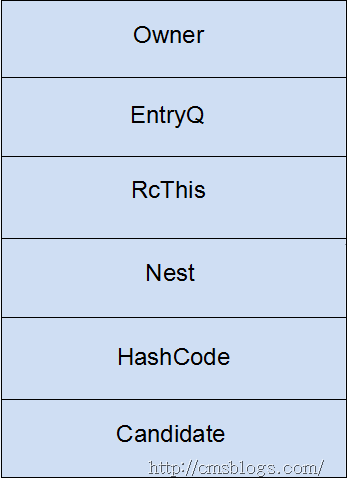

# synchronized原理分析


## 反编译同步代码段


反编译下面一段代码的class文件，看一下synchronzied是怎么实现的。

```
package com.zch.blogs.java.multithreads.synchronizeddemo;

public class SynchronizedDemo8 {
	public void method() {
		synchronized (this) {
			System.out.println("Method 1 start");
		}
	}
}

```

通过下面命令反编译，反编译之前要生成class文件。

```
javap -c SynchronizedDemo8
```

反编译结果如下：

```

警告: 二进制文件SynchronizedDemo8包含com.zch.blogs.java.multithreads.synchronizeddemo.SynchronizedDemo8
Compiled from "SynchronizedDemo8.java"
public class com.zch.blogs.java.multithreads.synchronizeddemo.SynchronizedDemo8 {
  public com.zch.blogs.java.multithreads.synchronizeddemo.SynchronizedDemo8();
    Code:
       0: aload_0
       1: invokespecial #1                  // Method java/lang/Object."<init>":()V
       4: return

  public void method();
    Code:
       0: aload_0
       1: dup
       2: astore_1
       3: monitorenter
       4: getstatic     #2                  // Field java/lang/System.out:Ljava/io/PrintStream;
       7: ldc           #3                  // String Method 1 start
       9: invokevirtual #4                  // Method java/io/PrintStream.println:(Ljava/lang/String;)V
      12: aload_1
      13: monitorexit
      14: goto          22
      17: astore_2
      18: aload_1
      19: monitorexit
      20: aload_2
      21: athrow
      22: return
    Exception table:
       from    to  target type
           4    14    17   any
          17    20    17   any
}
```

可以看到有两条重要命令monitorenter和monitorexit


关于这两条指令的作用，我们直接参考JVM规范中描述：

**monitorenter ：**
>Each object is associated with a monitor. A monitor is locked if and only if it has an owner. The thread that executes monitorenter attempts to gain ownership of the monitor associated with objectref, as follows:

>• If the entry count of the monitor associated with objectref is zero, the thread enters the monitor and sets its entry count to one. The thread is then the owner of the monitor.

>• If the thread already owns the monitor associated with objectref, it reenters the monitor, incrementing its entry count.

>• If another thread already owns the monitor associated with objectref, the thread blocks until the monitor's entry count is zero, then tries again to gain ownership.

这段话的大概意思为：

每个对象有一个监视器锁（monitor）。当monitor被占用时就会处于锁定状态，线程执行monitorenter指令时尝试获取monitor的所有权，过程如下：

1、如果monitor的进入数为0，则该线程进入monitor，然后将进入数设置为1，该线程即为monitor的所有者。

2、如果线程已经占有该monitor，只是重新进入，则进入monitor的进入数加1.

3.如果其他线程已经占用了monitor，则该线程进入阻塞状态，直到monitor的进入数为0，再重新尝试获取monitor的所有权。

**monitorexit：**

>The thread that executes monitorexit must be the owner of the monitor associated with the instance referenced by objectref.

>The thread decrements the entry count of the monitor associated with objectref. If as a result the value of the entry count is zero, the thread exits the monitor and is no longer its owner. Other threads that are blocking to enter the monitor are allowed to attempt to do so.


这段话的大概意思为：

执行monitorexit的线程必须是objectref所对应的monitor的所有者。

指令执行时，monitor的进入数减1，如果减1后进入数为0，那线程退出monitor，不再是这个monitor的所有者。其他被这个monitor阻塞的线程可以尝试去获取这个 monitor 的所有权。


通过这两段描述，我们应该能很清楚的看出Synchronized的实现原理，Synchronized的语义底层是通过一个monitor的对象来完成，其实wait/notify等方法也依赖于monitor对象，这就是为什么只有在同步的块或者方法中才能调用wait/notify等方法，否则会抛出java.lang.IllegalMonitorStateException的异常的原因。


## 同步方法的反编译

下面这段代码，用上面的方法反编译。

```

package com.zch.blogs.java.multithreads.synchronizeddemo;

public class SynchronizedDemo9 {
	public synchronized void method() {
		System.out.println("Method 1 start");
	}
}


```

其结果是：

```

警告: 二进制文件SynchronizedDemo9包含com.zch.blogs.java.multithreads.synchronizeddemo.SynchronizedDemo9
Compiled from "SynchronizedDemo9.java"
public class com.zch.blogs.java.multithreads.synchronizeddemo.SynchronizedDemo9 {
  public com.zch.blogs.java.multithreads.synchronizeddemo.SynchronizedDemo9();
    Code:
       0: aload_0
       1: invokespecial #1                  // Method java/lang/Object."<init>":()V
       4: return

  public synchronized void method();
    Code:
       0: getstatic     #2                  // Field java/lang/System.out:Ljava/io/PrintStream;
       3: ldc           #3                  // String Method 1 start
       5: invokevirtual #4                  // Method java/io/PrintStream.println:(Ljava/lang/String;)V
       8: return
}

```


反编译的结果来看，方法的同步并没有通过指令monitorenter和monitorexit来完成。

但别人反编译出来有ACC_SYNCHRONIZED，我的没有，不知道为什么。

下面是别人的说法：

>不过相对于普通方法，其常量池中多了ACC_SYNCHRONIZED标示符。JVM就是根据该标示符来实现方法的同步的：当方法调用时，调用指令将会检查方法的 ACC_SYNCHRONIZED 访问标志是否被设置，如果设置了，执行线程将先获取monitor，获取成功之后才能执行方法体，方法执行完后再释放monitor。在方法执行期间，其他任何线程都无法再获得同一个monitor对象。 其实本质上没有区别，只是方法的同步是一种隐式的方式来实现，无需通过字节码来完成。

还有另外一种方法：

>同步方法：synchronized方法则会被翻译成普通的方法调用和返回指令如:invokevirtual、areturn指令，在VM字节码层面并没有任何特别的指令来实现被synchronized修饰的方法，而是在Class文件的方法表中将该方法的access_flags字段中的synchronized标志位置1，表示该方法是同步方法并使用调用该方法的对象或该方法所属的Class在JVM的内部对象表示Klass做为锁对象。(摘自：http://www.cnblogs.com/javaminer/p/3889023.html)

## Java对象头

synchronized用的锁是存在Java对象头里的，那么什么是Java对象头呢？Hotspot虚拟机的对象头主要包括两部分数据：Mark Word（标记字段）、Klass Pointer（类型指针）。其中Klass Point是是对象指向它的类元数据的指针，虚拟机通过这个指针来确定这个对象是哪个类的实例，Mark Word用于存储对象自身的运行时数据，它是实现轻量级锁和偏向锁的关键，所以下面将重点阐述Mark Word。

Mark Word用于存储对象自身的运行时数据，如哈希码（HashCode）、GC分代年龄、锁状态标志、线程持有的锁、偏向线程 ID、偏向时间戳等等。Java对象头一般占有两个机器码（在32位虚拟机中，1个机器码等于4字节，也就是32bit），但是如果对象是数组类型，则需要三个机器码，因为JVM虚拟机可以通过Java对象的元数据信息确定Java对象的大小，但是无法从数组的元数据来确认数组的大小，所以用一块来记录数组长度。下图是Java对象头的存储结构（32位虚拟机）：

|对象的hashcode |对象的年代分布 |是否偏斜锁 |锁标记位 |
|-|-|-|-|
|25bit |4bit |1bit |2bit |


对象头信息是与对象自身定义的数据无关的额外存储成本，但是考虑到虚拟机的空间效率，Mark Word被设计成一个非固定的数据结构以便在极小的空间内存存储尽量多的数据，它会根据对象的状态复用自己的存储空间，也就是说，Mark Word会随着程序的运行发生变化，变化状态如下（32位虚拟机）：


## Monitor

什么是Monitor？我们可以把它理解为一个同步工具，也可以描述为一种同步机制，它通常被描述为一个对象。
与一切皆对象一样，所有的Java对象是天生的Monitor，每一个Java对象都有成为Monitor的潜质，因为在Java的设计中 ，每一个Java对象自打娘胎里出来就带了一把看不见的锁，它叫做内部锁或者Monitor锁。
Monitor 是线程私有的数据结构，每一个线程都有一个可用monitor record列表，同时还有一个全局的可用列表。每一个被锁住的对象都会和一个monitor关联（对象头的MarkWord中的LockWord指向monitor的起始地址），同时monitor中有一个Owner字段存放拥有该锁的线程的唯一标识，表示该锁被这个线程占用。其结构如下：  



- Owner：初始时为NULL表示当前没有任何线程拥有该monitor record，当线程成功拥有该锁后保存线程唯一标识，当锁被释放时又设置为NULL；
- EntryQ:关联一个系统互斥锁（semaphore），阻塞所有试图锁住monitor record失败的线程。
- RcThis:表示blocked或waiting在该monitor record上的所有线程的个数。
- Nest:用来实现重入锁的计数。
- HashCode:保存从对象头拷贝过来的HashCode值（可能还包含GC age）。
- Candidate:用来避免不必要的阻塞或等待线程唤醒，因为每一次只有一个线程能够成功拥有锁，如果每次前一个释放锁的线程唤醒所有正在阻塞或等待的线程，会引起不必要的上下文切换（从阻塞到就绪然后因为竞争锁失败又被阻塞）从而导致性能严重下降。Candidate只有两种可能的值0表示没有需要唤醒的线程1表示要唤醒一个继任线程来竞争锁。
摘自：Java中synchronized的实现原理与应用）


## 锁优化

在Java6之前，Monitor的实现完全是依靠操作系统内部的互斥锁，因为需要进行用户态到内核态的切换，所以同步操作是一个无差别的重量级操作。

现在JDK中，JVM对此进行了大刀阔斧地改进，提供了三种不同的Monitor实现，也就是说三种不同的锁：偏斜锁（Biased Locking）、轻量级锁和重量级锁，大大改进了其性能。

所谓锁的升级、降级，就是JVM优化synchronized运行的机制，当JVM检测到不同的竞争状况时，会自动切换到适合的锁实现，这种切换就是锁的升级、降级。

当没有竞争出现时，默认会使用偏斜锁。JVM会利用CAS操作，在对象头上的Mark Word部分设置线程ID，以表示这个对象偏向于当前线程，所以并不设计真正的互斥锁。这样做的假设是基于在很多应用场景中，大部分对象生命周末最多会被一个线程锁定，使用偏斜锁可以降低无竞争开销。

如果有另外的线程试图锁定某个已经被偏斜过的对象，JVM就需要撤销偏斜锁，并切换到轻量级锁实现。轻量级锁依赖CAS操作Mark Word来试图获取锁，如果重试成果，就使用普通的轻量级锁；否则，进一步升级为重量级锁。

偏斜锁、轻量级锁、重量级锁的代码实现在JVM，而不是核心类库。


jdk1.6对锁的实现引入了大量的优化，如自旋锁、适应性自旋锁、锁消除、锁粗化、偏向锁、轻量级锁等技术来减少锁操作的开销。
锁主要存在四中状态，依次是：无锁状态、偏向锁状态、轻量级锁状态、重量级锁状态，他们会随着竞争的激烈而逐渐升级。<s>注意锁可以升级不可降级，这种策略是为了提高获得锁和释放锁的效率。</s>【这句话不对】

**自旋锁**

线程的阻塞和唤醒需要CPU从用户态转为核心态，频繁的阻塞和唤醒对CPU来说是一件负担很重的工作，势必会给系统的并发性能带来很大的压力。同时我们发现在许多应用上面，对象锁的锁状态只会持续很短一段时间，为了这一段很短的时间频繁地阻塞和唤醒线程是非常不值得的。所以引入自旋锁。
何谓自旋锁？
所谓自旋锁，就是让该线程等待一段时间，不会被立即挂起，看持有锁的线程是否会很快释放锁。怎么等待呢？执行一段无意义的循环即可（自旋）。
自旋等待不能替代阻塞，先不说对处理器数量的要求（多核，貌似现在没有单核的处理器了），虽然它可以避免线程切换带来的开销，但是它占用了处理器的时间。如果持有锁的线程很快就释放了锁，那么自旋的效率就非常好，反之，自旋的线程就会白白消耗掉处理的资源，它不会做任何有意义的工作，典型的占着茅坑不拉屎，这样反而会带来性能上的浪费。所以说，自旋等待的时间（自旋的次数）必须要有一个限度，如果自旋超过了定义的时间仍然没有获取到锁，则应该被挂起。
自旋锁在JDK 1.4.2中引入，默认关闭，但是可以使用-XX:+UseSpinning开开启，在JDK1.6中默认开启。同时自旋的默认次数为10次，可以通过参数-XX:PreBlockSpin来调整；
如果通过参数-XX:preBlockSpin来调整自旋锁的自旋次数，会带来诸多不便。假如我将参数调整为10，但是系统很多线程都是等你刚刚退出的时候就释放了锁（假如你多自旋一两次就可以获取锁），你是不是很尴尬。于是JDK1.6引入自适应的自旋锁，让虚拟机会变得越来越聪明。

**适应自旋锁**

JDK 1.6引入了更加聪明的自旋锁，即自适应自旋锁。所谓自适应就意味着自旋的次数不再是固定的，它是由前一次在同一个锁上的自旋时间及锁的拥有者的状态来决定。它怎么做呢？线程如果自旋成功了，那么下次自旋的次数会更加多，因为虚拟机认为既然上次成功了，那么此次自旋也很有可能会再次成功，那么它就会允许自旋等待持续的次数更多。反之，如果对于某个锁，很少有自旋能够成功的，那么在以后要或者这个锁的时候自旋的次数会减少甚至省略掉自旋过程，以免浪费处理器资源。
有了自适应自旋锁，随着程序运行和性能监控信息的不断完善，虚拟机对程序锁的状况预测会越来越准确，虚拟机会变得越来越聪明。

**锁消除**

为了保证数据的完整性，我们在进行操作时需要对这部分操作进行同步控制，但是在有些情况下，JVM检测到不可能存在共享数据竞争，这是JVM会对这些同步锁进行锁消除。锁消除的依据是逃逸分析的数据支持。
如果不存在竞争，为什么还需要加锁呢？所以锁消除可以节省毫无意义的请求锁的时间。变量是否逃逸，对于虚拟机来说需要使用数据流分析来确定，但是对于我们程序员来说这还不清楚么？我们会在明明知道不存在数据竞争的代码块前加上同步吗？但是有时候程序并不是我们所想的那样？我们虽然没有显示使用锁，但是我们在使用一些JDK的内置API时，如StringBuffer、Vector、HashTable等，这个时候会存在隐形的加锁操作。比如StringBuffer的append()方法，Vector的add()方法：

```
   public void vectorTest(){
        Vector<String> vector = new Vector<String>();
        for(int i = 0 ; i < 10 ; i++){
            vector.add(i + "");
        }

        System.out.println(vector);
    }

```


在运行这段代码时，JVM可以明显检测到变量vector没有逃逸出方法vectorTest()之外，所以JVM可以大胆地将vector内部的加锁操作消除。

**锁粗化**

我们知道在使用同步锁的时候，需要让同步块的作用范围尽可能小—仅在共享数据的实际作用域中才进行同步，这样做的目的是为了使需要同步的操作数量尽可能缩小，如果存在锁竞争，那么等待锁的线程也能尽快拿到锁。
在大多数的情况下，上述观点是正确的。但是如果一系列的连续加锁解锁操作，可能会导致不必要的性能损耗，所以引入锁粗话的概念。
锁粗话概念比较好理解，就是将多个连续的加锁、解锁操作连接在一起，扩展成一个范围更大的锁。如上面实例：vector每次add的时候都需要加锁操作，JVM检测到对同一个对象（vector）连续加锁、解锁操作，会合并一个更大范围的加锁、解锁操作，即加锁解锁操作会移到for循环之外。

**轻量级锁**

引入轻量级锁的主要目的是在多没有多线程竞争的前提下，减少传统的重量级锁使用操作系统互斥量产生的性能消耗。当关闭偏向锁功能或者多个线程竞争偏向锁导致偏向锁升级为轻量级锁，则会尝试获取轻量级锁，其步骤如下：

*获取锁*

1. 判断当前对象是否处于无锁状态（hashcode、0、01），若是，则JVM首先将在当前线程的栈帧中建立一个名为锁记录（Lock Record）的空间，用于存储锁对象目前的Mark Word的拷贝（官方把这份拷贝加了一个Displaced前缀，即Displaced Mark Word）；否则执行步骤（3）；
2. JVM利用CAS操作尝试将对象的Mark Word更新为指向Lock Record的指正，如果成功表示竞争到锁，则将锁标志位变成00（表示此对象处于轻量级锁状态），执行同步操作；如果失败则执行步骤（3）；
3. 判断当前对象的Mark Word是否指向当前线程的栈帧，如果是则表示当前线程已经持有当前对象的锁，则直接执行同步代码块；否则只能说明该锁对象已经被其他线程抢占了，这时轻量级锁需要膨胀为重量级锁，锁标志位变成10，后面等待的线程将会进入阻塞状态；

*释放锁*

轻量级锁的释放也是通过CAS操作来进行的，主要步骤如下：

1. 取出在获取轻量级锁保存在Displaced Mark Word中的数据；
2. 用CAS操作将取出的数据替换当前对象的Mark Word中，如果成功，则说明释放锁成功，否则执行（3）；
3. 如果CAS操作替换失败，说明有其他线程尝试获取该锁，则需要在释放锁的同时需要唤醒被挂起的线程。

对于轻量级锁，其性能提升的依据是“对于绝大部分的锁，在整个生命周期内都是不会存在竞争的”，如果打破这个依据则除了互斥的开销外，还有额外的CAS操作，因此在有多线程竞争的情况下，轻量级锁比重量级锁更慢；

下图是轻量级锁的获取和释放过程


**偏向锁**

引入偏向锁主要目的是：为了在无多线程竞争的情况下尽量减少不必要的轻量级锁执行路径。上面提到了轻量级锁的加锁解锁操作是需要依赖多次CAS原子指令的。那么偏向锁是如何来减少不必要的CAS操作呢？我们可以查看Mark work的结构就明白了。只需要检查是否为偏向锁、锁标识为以及ThreadID即可，处理流程如下：

*获取锁*

1. 检测Mark Word是否为可偏向状态，即是否为偏向锁1，锁标识位为01；
2. 若为可偏向状态，则测试线程ID是否为当前线程ID，如果是，则执行步骤（5），否则执行步骤（3）；
3. 如果线程ID不为当前线程ID，则通过CAS操作竞争锁，竞争成功，则将Mark Word的线程ID替换为当前线程ID，否则执行线程（4）；
4. 通过CAS竞争锁失败，证明当前存在多线程竞争情况，当到达全局安全点，获得偏向锁的线程被挂起，偏向锁升级为轻量级锁，然后被阻塞在安全点的线程继续往下执行同步代码块；
5. 执行同步代码块

*释放锁*

偏向锁的释放采用了一种只有竞争才会释放锁的机制，线程是不会主动去释放偏向锁，需要等待其他线程来竞争。偏向锁的撤销需要等待全局安全点（这个时间点是上没有正在执行的代码）。其步骤如下：

1. 暂停拥有偏向锁的线程，判断锁对象石是否还处于被锁定状态；
2. 撤销偏向苏，恢复到无锁状态（01）或者轻量级锁的状态；
下图是偏向锁的获取和释放流程


**重量级锁**

重量级锁通过对象内部的监视器（monitor）实现，其中monitor的本质是依赖于底层操作系统的Mutex Lock实现，操作系统实现线程之间的切换需要从用户态到内核态的切换，切换成本非常高。

## 参考

- [Java并发编程：Synchronized及其实现原理](https://www.cnblogs.com/paddix/p/5367116.html)
- [【死磕Java并发】—–深入分析synchronized的实现原理](http://cmsblogs.com/?p=2071)
