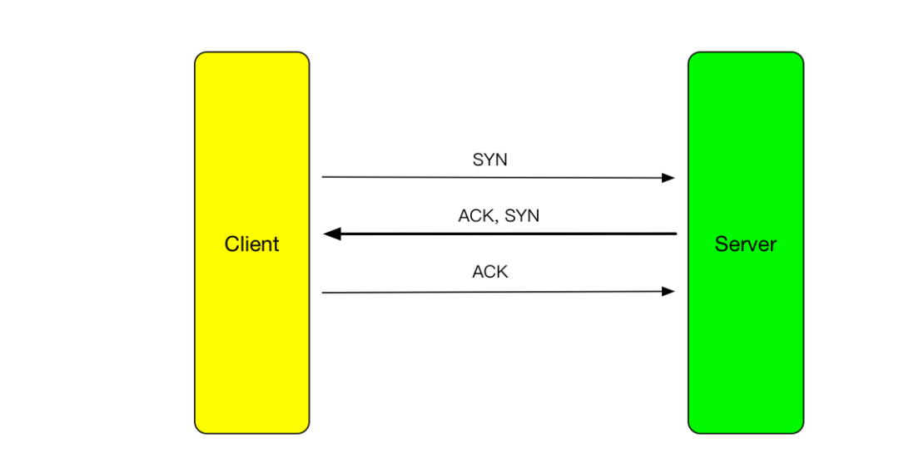
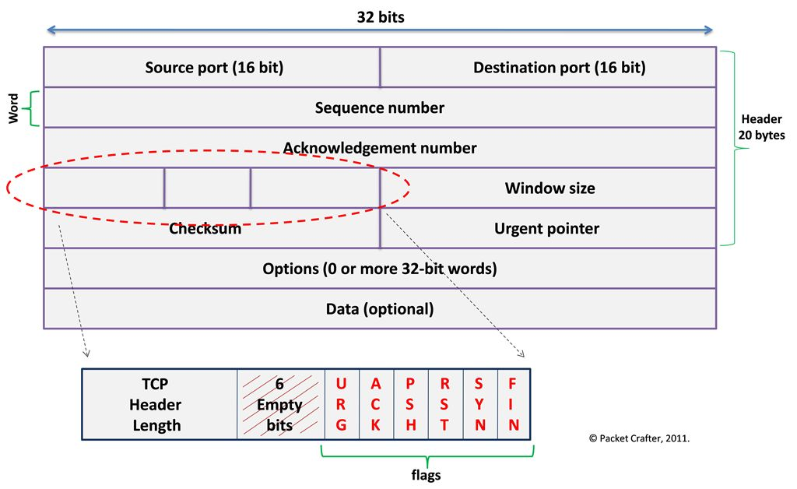
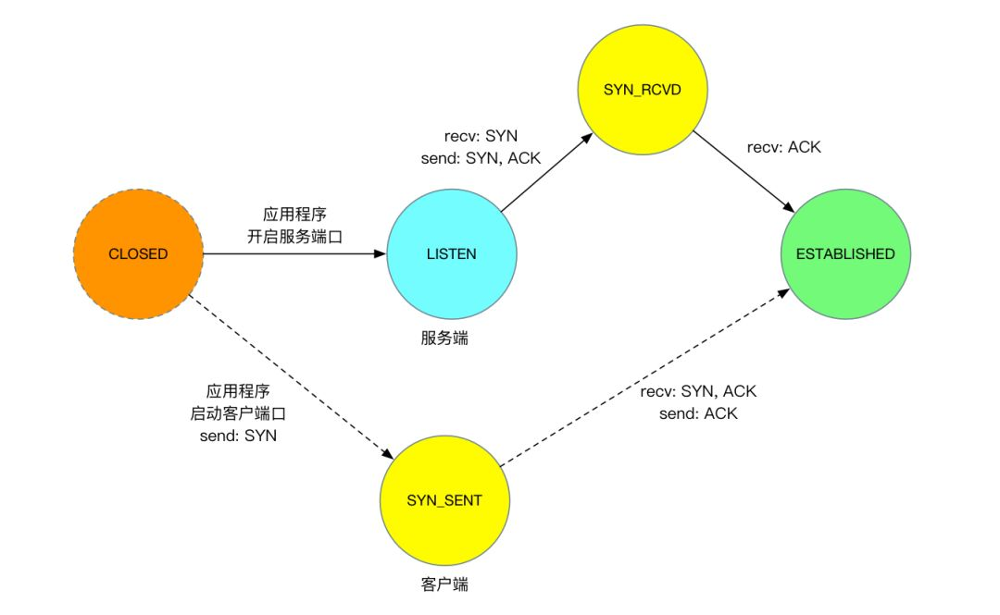
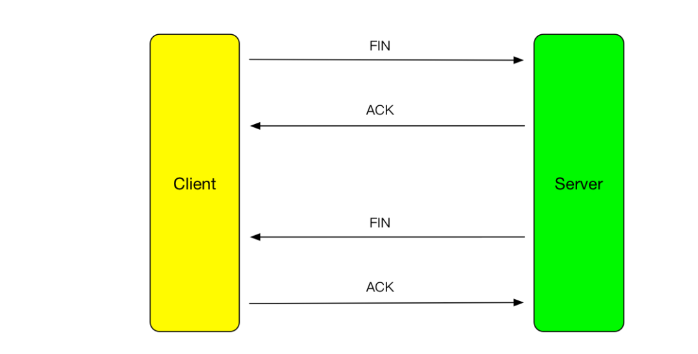

# TCP三次握手和四次挥手学习

## 三次握手

“三次握手”的原文是three-way handshake，three-way更合适的翻译恐怕是“三步”，所以整个名词的意思是“需要三个步骤才能建立握手的机制”。这么解释的好处是，“步”给人感觉更形象，就是“单方面迈一步”而已。实际上，RFC 793里说明了，握手过程也可以叫three-message handshake，通过三条消息来建立的握手。

回到TCP，既然它是双向、可靠的通讯，可以想见，建立连接就必须确认双方到对方的通讯都是可靠的，所以大概需要四步，发送四次消息。

如果软件设计都这么简单，那就太好了。可惜，世界上没有那么简单的事情。仔细观察这幅图，我们会发现几个问题：

- 第一，网络通讯的成本是很高的，延迟往往无法预测，哪怕能少发送一次消息，也可以大大降低成本，提高效率。所以，建立连接的步骤上限应当是四步，下限是两步，越少越好。
- 第二，两轮SYN/ACK之间必须有关联，因为它们的功能相对独立，都是确认到对方的通讯可靠，却同属于一个“建立连接”的逻辑操作。如果两轮完全独立，那么如果两轮中间间隔了特别特别长的时间，根本不是一个正常的建立连接的操作，程序却无法识别，这显然是不行的。所以，第二轮SYN/ACK必须要能够和第一轮SYN/ACK关联起来。

再仔细看看，第二步和第三步都是从服务端给客户端发消息，所以是不是可以合并起来？这样起码可以节省了一次网络通讯。

像上面这样直接在第二步把ACK和SYN合并起来，问题就解决了？

按照之前的分析，节省消息发送次数只是考虑之一，还需要考虑的是，第二轮SYN/ACK必须和第一轮SYN/ACK挂钩。

上面是TCP的数据报，包含了许多的控制位，用来标识连接的状态。其中最常见的是SYN、ACK、FIN：SYN表示synchronize，在建立连接时使用；ACK表示acknowledge，表示“确认”收到了消息；FIN表示finish，在断开连接时使用。

还要注意的两个东西是SEQ NO和ACK NO。SEQ NO即Sequence Number，服务端和客户端都会维护自己的SEQ NO，表示“已经发送了多少数据”，单位是字节；ACK NO即Acknowledge Number，用来回复确认，对应SEQ NO的数据已经收到。单独说起来，这些概念都容易理解，只是注意不要混淆控制位的ACK和ACK NO——ACK是布尔值用来标识数据报的类型，ACK NO是数值用来确认已经收到的数据。

基于上面的知识我们可以知道，在建立连接之初，数据报中的控制位SYN应当设定为1，表示“新建连接”；同时应当包含SEQ NO。此时的SEQ NO有个专门的名字叫ISN，也就是Initial Sequence Number（要注意，ISN只是用来称呼这个特殊SEQ NO，并不存在专门的ISN字段）。

在服务端收到第一个SYN消息的时候，它当然需要发送ACK响应，但它如何确认其中的SEQ NO“就是”新建连接的ISN，而不是来自姗姗来迟的某个古老连接呢？所以必须向客户端确认。恰恰因为第二步是ACK,SYN“合二为一”的独特响应，所以收到这个消息时，客户端就知道，既需要响应其中的SYN，也需要核实其中的ACK（如果你仔细读过RFC793就会知道，其中专门有一段提到了：A three way handshake is necessary because……）

到了第三步，客户端返回的消息里既包含对应SYN的ACK，表示收到了服务端的消息，同时设定SEQ NO=ISN+1，确认核实了ISN。服务端收到这条消息，确认无误是要建立新连接。至此，连接建立完毕。

大流程看起来就是这样，也不难理解。不过仔细想想，还是有不少问题得考虑的。比如状态问题，既然TCP是网络通讯，会发生延迟，那么在“信息已经发送，但还没有收到确认”的时候，应当是有个明确状态的，否则会发生状态的错乱。实际上TCP也确实做到了这点，它背后有一台完整的状态机，确保每时每刻，每个动作发生之后，状态都完全可控，一切尽在掌握，不会出现任何“孤点”和“断头路”。

上图是TCP的状态转移图的局部，覆盖了建立链接的状态，感兴趣的读者可以按照自己实地走走看。

回到TCP建立连接的过程，我们还要注意ISN。在建立连接时必须先确定ISN，通过它把客户端和服务器的计数对齐。通常的教材上说，ISN是随机生成的，这样就保证了唯一性。随机的目的是保持唯一，但千万不要以为“随机就不会重复”，简单的“取随机数”是很容易碰撞的。所以传统的“随机”方案是维护一个时钟和一个32位的计数器，时钟每过4毫秒，计数器自增1。因为2^32毫秒就是差不多4个半小时（MSL，Max Segment Lifetime），这基本超出了任何数据包在网络中的可能传输时间，所以可以认为这种ISN是独一无二的。

但这种方案也有风险，既然这样的ISN是连续的，那么中途的恶意程序可能能够预测ISN的生成规律，从而伪造ISN…… 总之ISN的生成是个有趣的设计问题，这里不展开了，有兴趣可以自己搜索资料阅读。

## 四次挥手

说完了建立连接的握手，我们再来看终止连接的挥手。通常大家都知道，TCP是“三次握手，四次挥手”（虽然我很不赞成“次”，但既然它已经约定俗成，这里还是延用通用的说法吧）。那么，为什么要四次才能挥手呢？

知道这个答案的人比能讲清楚“三次握手”的要多。通常的答案都是：TCP是双向通讯协议，要结束连接，双方都必须发送终止信号，告诉对方后续再没有数据发过来了，并等待对方确认，所以一共需要2+2=4次。

如果你之前看过建立连接的过程，大概会有这样的疑问：既然建立连接的时候可以节省一步，把服务端返回SYN和ACK合并到一起，那么结束连接的时候，是否也可以把服务端返回的SYN和FIN合并起来，节省一步呢？

想到了这个问题就值得恭喜，因为你不是只满足于“知其然”，而希望“知其所以然”。不过我们也需要想到，既然TCP连接的建立和终止都是同一批人定义的，既然他们能想到在建立连接时节省一步，那么他们没有理由在终止连接时不做节省。之所以没有“节省”，一定是有理由存在的。

没错，确实是有理由的，而且这个理由很好理解，因为建立和终止连接的场景是不一样的。在建立连接之前，客户端和服务器端都不会向对方发送任何数据，所以在服务端返回ACK的时候带上SYN，客户端当然知道这是从服务端收到的第一个数据包。

而在结束连接时，客户端向服务端发送FIN，表示“我这边不会继续发送数据过来了”，服务端响应ACK，这都没有问题。但此时，服务端之前向客户端发送数据的操作可能还没有完成，服务端仍然在向客户端传输数据。如果服务端把FIN和ACK合并起来，就会出现这样的情况：客户端的数据还没有接受完，忽然收到服务端的消息“后续没有数据了，终止连接”。显然，这种情况不应当出现，所以不能把ACK和FIN合并在一起，所以终止连接必须要四步。

## 参考
- [TCP没那么难吧？](https://mp.weixin.qq.com/s/zRelB6uSz07YaCoJoggZZA)
